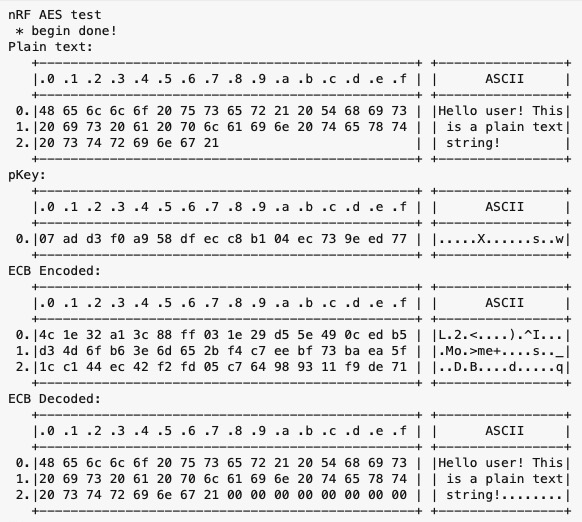
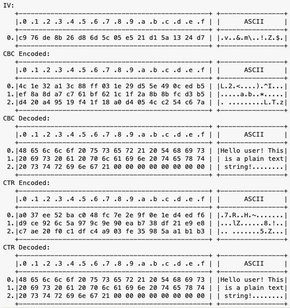

# Adafruit nRFCrypto

Adafruit Arduino Cryptography Library using hardware-accelerated ARM CryptoCell CC310 on nRF52-based Bluefruit. CryptoCell CC310 is only available on nRF52840 therefore nRF52832 is not supported by this library.

Although this library license is MIT, it uses ARM precompiled static library, which has its own [licence here](src/cortex-m4/license.txt). Please make sure you understand all the license term for files you use in your project. 

## The Fork

A library that calls itself "Crypto" should have Crypto functions – especially since the CC310 has them. So I added a new class, `nRFCrypto_AES`, which provides AES encryption and decryption, ECB, CBC and CTR modes. An example sketch is provided. For the key, and the IV, I am using the library's `Random` object. Might as well...

